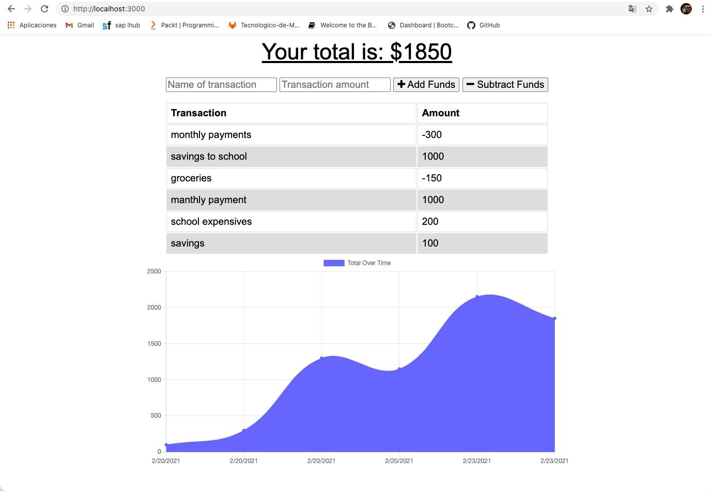
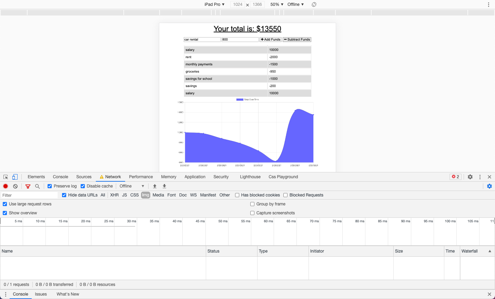

# Budget-Trackers
This is a simple Budget Tracker application that allows you online and offline access and functionality

# Use 

The user will be able to add expenses and deposits to their budget with or without a connection. When entering transactions offline, they should populate the total when brought back online.

Offline Functionality:

  * Enter deposits offline

  * Enter expenses offline

When brought back online:

  * Offline entries should be added to tracker.

## User Story
AS AN avid traveller
I WANT to be able to track my withdrawals and deposits with or without a data/internet connection
SO THAT my account balance is accurate when I am traveling
GIVEN a user is on Budget App without an internet connection
WHEN the user inputs a withdrawal or deposit
THEN that will be shown on the page, and added to their transaction history when their connection is back online.

## Business Context

Giving users a fast and easy way to track their money is important, but allowing them to access that information anytime is even more important. Having offline functionality is paramount to our applications success.

## Heroku App

* **HEROKU APP** [HEROKU APP](https://alhe-budget.herokuapp.com/)

## CONTRIBUTE

**GitHub Repository** [Github Repository](https://github.com/AlheliMi/Budget-Trackers.git)

* **Alhelí Miranda Campos** [Github: AlheliMi](https://github.com/AlheliMi)
